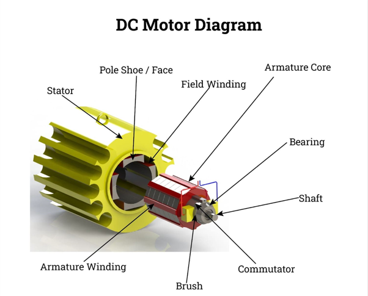

### Theory

Controlling external electrical devices such as **DC motors** through a microcontroller like the **Raspberry Pi** requires safe interfacing methods. One such approach involves the use of a **relay switch**—an electrically operated switch that isolates and manages high-power components using low-power signals from the Raspberry Pi. This experiment focuses on demonstrating how to use a relay module to control a DC motor from the Raspberry Pi's GPIO pins.

#### Components and Their Functions

#### 1. Raspberry Pi

- Acts as the main controller in this experiment.  
- Sends GPIO signals to the relay module based on the control logic.  
- Operates at 3.3V logic level, which is compatible with most relay modules.  
- Cannot directly drive high-current devices like motors, so it relies on the relay for switching.

  

#### 2. DC Motor
- A rotary electrical machine that converts **electrical energy into mechanical rotation**.  
- Operates on the principle that a **current-carrying conductor in a magnetic field experiences a force**, producing motion.  
- Used here as the output device, powered by an external source and activated through the relay.  
- Common in robotics, automation, and electronics for its simplicity and ease of control.  

  

#### 3. Relay Module (5V)
- An **electromechanical switch** that uses a small electrical signal to control a higher-powered circuit.  
- It uses a GPIO pin on the Raspberry Pi to activate its internal switch.  
- Provides **electrical isolation** and safely controls the **motor’s higher voltage**, protecting the Raspberry Pi.  
- This module allows control over the DC motor's power supply using logic signals.  

  

#### 4. 9V Battery
- Provides an **external power source** for the DC motor, preventing the Raspberry Pi from bearing the current load.  
- Powers the motor when the relay closes the circuit.  

  

#### Explanation of Each Connection

1. Connect the Relay to the Raspberry Pi
- Connect the **3.3V pin** (Physical Pin 1) of the Raspberry Pi to the **VCC pin** of the relay to supply power.  
- Connect a **GND pin** (e.g., Physical Pin 9) of the Raspberry Pi to the **GND pin** of the relay to complete the control circuit.  
- Connect **GPIO21** (Physical Pin 40) of the Raspberry Pi to the **Input pin** of the relay to control its switching mechanism.

 2. Connect the Relay to the Motor and Battery
- Connect the **COM (Common) pin** of the relay to the **positive (+)** terminal of the **9V battery**.  
- Connect the **NO (Normally Open) pin** of the relay to the **positive (+)** terminal of the **DC motor**.  
- Connect the **negative (-)** terminal of the 9V battery to the **negative (-)** terminal of the DC motor to complete the motor circuit.

3. Verify Connections
- Double-check all physical connections to ensure accuracy, polarity, and proper wire placement.  
- Ensure the breadboard layout matches the circuit diagram.

 4. Software Execution
- After completing all the wiring, click the **“Code”** button followed by the **“Submit”** button in the software interface (if applicable).  
- This will trigger the GPIO logic to activate the relay and control the motor.
